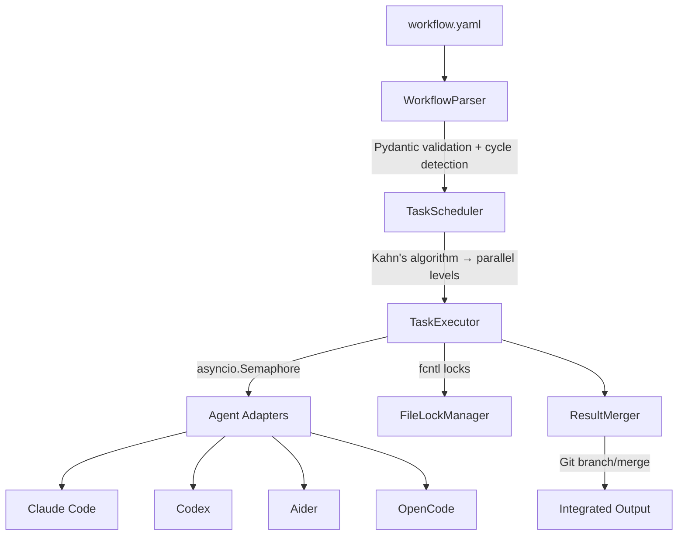

[中文版](README.zh-CN.md) | English

# AgentCollab

**Let your AI coding tools work together.**

[](https://github.com/JianFeiGan/agent-collab/actions/workflows/ci.yml)
[](https://pypi.org/project/agent-collab/)
[](https://www.python.org/downloads/)
[](LICENSE)
[](tests/)
[](tests/)

AgentCollab is a CLI tool that orchestrates multiple AI coding agents (Claude Code, Codex, Aider) to collaborate on a software project. Define your tasks in YAML — AgentCollab handles scheduling, parallel execution, file locking, and result merging.

---

## How is this different from CrewAI / AutoGen?

AgentCollab is **not** a general-purpose agent framework. It's a thin orchestration layer over the AI coding tools you already use.

| | AgentCollab | CrewAI | AutoGen | LangGraph |
|--|------------|--------|---------|-----------|
| **Interface** | CLI + YAML | Python SDK | Python SDK | Python SDK |
| **Agents** | Your installed tools (Claude Code, Codex, Aider) | Custom LLM agents | Custom LLM agents | Custom LLM agents |
| **File safety** | File locks + Git merge | None | None | None |
| **Setup time** | 5 min (write YAML) | Hours (write Python) | Hours (write Python) | Hours (write Python) |
| **Best for** | AI coding collaboration | General multi-agent | Conversational agents | Complex graph workflows |

**When to use AgentCollab:** You want Claude Code, Codex, or Aider to work on different parts of your codebase simultaneously, without them stepping on each other's files.

**When to use something else:** You need custom agent logic, tool definitions, or conversational agent loops.

---

## Install

```bash
pip install agent-collab
# or
uv pip install agent-collab
```

Requires Python 3.11+ and at least one AI agent CLI:

| Agent | Install |
|-------|---------|
| [Claude Code](https://docs.anthropic.com/en/docs/claude-code) | `npm install -g @anthropic-ai/claude-code` |
| [Codex](https://github.com/openai/codex) | `npm install -g @openai/codex` |
| [Aider](https://aider.chat) | `pip install aider-chat` |

---

## Quick Start

```yaml
# workflow.yaml — implement a feature, then review it
name: feature-with-review

agents:
  coder:
    type: claude-code
    model: sonnet
    allowed_tools: [Read, Write, Edit, Bash]
  reviewer:
    type: claude-code
    model: opus
    allowed_tools: [Read]

tasks:
  - id: implement
    agent: coder
    prompt: |
      Add a /health endpoint to the FastAPI app that returns
      {"status": "ok"} with a 200 status code.
    outputs: [app/main.py]

  - id: review
    depends_on: [implement]
    agent: reviewer
    prompt: |
      Review the /health endpoint implementation for
      correctness, error handling, and API best practices.

strategy:
  max_parallel: 2
  timeout_per_task: 300
```

```bash
agent-collab run workflow.yaml
```

---

## Real-World Example

The [`examples/real-world-demo.yaml`](examples/real-world-demo.yaml) workflow bootstraps a Python project with CI, tests, and documentation — **3 agents working in parallel**, then a reviewer validating everything:

```
Level 0 (parallel)           Level 1
┌─────────────┐
│ setup-ci     │──┐
└─────────────┘  │
┌─────────────┐  ├──→  ┌──────────────┐
│ write-tests  │──┤    │  review-all   │
└─────────────┘  │    └──────────────┘
┌─────────────┐  │
│ write-docs   │──┘
└─────────────┘
```

```bash
agent-collab run examples/real-world-demo.yaml
```

More examples in [`examples/`](examples/):

| Workflow | Description |
|----------|-------------|
| [`fullstack.yaml`](examples/fullstack.yaml) | Build FastAPI backend + React frontend in parallel, then security review |
| [`code-review.yaml`](examples/code-review.yaml) | Implement a feature, review it, then auto-fix issues |
| [`refactor.yaml`](examples/refactor.yaml) | Refactor two modules in parallel, then integrate |

---

## CLI Reference

### `agent-collab run <workflow.yaml>`

Execute a workflow. Independent tasks run in parallel; dependent tasks wait.

```bash
agent-collab run workflow.yaml
agent-collab run workflow.yaml --verbose
```

### `agent-collab validate <workflow.yaml>`

Validate a workflow without executing. Checks YAML syntax, agent references, dependency references, and circular dependencies.

```bash
agent-collab validate workflow.yaml
```

### `agent-collab list-agents`

Show registered agents and their availability.

```bash
agent-collab list-agents
```

---

## Workflow YAML Reference

```yaml
name: workflow-name          # Required
description: What it does    # Optional

agents:                      # Agent definitions
  agent-id:                  # Unique identifier
    type: claude-code        # Agent type: claude-code | codex | aider | opencode
    model: sonnet            # Model (default: sonnet)
    workdir: ./path          # Working directory (default: .)
    allowed_tools: [Read]    # Tools the agent may use

tasks:                       # Task definitions
  - id: task-id              # Unique identifier
    agent: agent-id          # Reference to an agent above
    prompt: |                # Instructions for the agent
      Do this specific thing.
      Supports ${VAR} variables and ${task_id.output} references.
    depends_on: [other-id]   # Tasks that must complete first
    outputs: [path/]         # Files this task may modify
    merge_strategy: comments # How to handle outputs
    priority: 10             # Higher = runs first within parallel level

variables:                   # Workflow-level variables
  env_name: production

strategy:                    # Execution settings
  max_parallel: 4            # Max concurrent tasks (default: 4)
  retry_on_failure: false    # Retry failed tasks (default: false)
  max_retries: 0             # Max retry attempts (default: 0)
  timeout_per_task: 600      # Seconds per task (default: 600)
```

---

## Architecture



---

## Contributing

See [CONTRIBUTING.md](CONTRIBUTING.md) for development setup, coding standards, and how to add new agent adapters.

---

## License

MIT License. See [LICENSE](LICENSE) for details.
