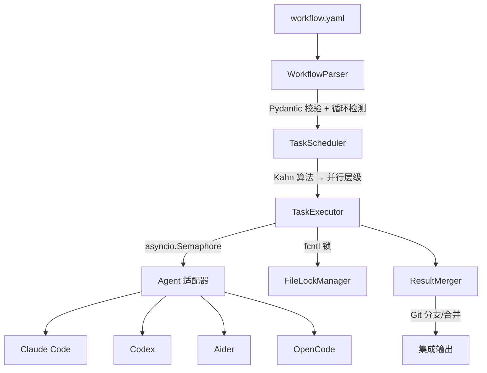

中文版 | [English](README.md)

# AgentCollab

**让 AI 编程工具协同工作。**

[](https://github.com/JianFeiGan/agent-collab/actions/workflows/ci.yml)
[](https://pypi.org/project/agent-collab/)
[](https://www.python.org/downloads/)
[](LICENSE)
[](tests/)
[](tests/)

AgentCollab 是一个 CLI 工具，编排多个 AI 编程智能体（Claude Code、Codex、Aider）协作完成软件项目。用 YAML 定义任务，AgentCollab 处理调度、并行执行、文件锁定和结果合并。

---

## 和 CrewAI / AutoGen 有什么区别？

AgentCollab **不是**通用 Agent 框架，而是你已有 AI 编程工具之上的轻量编排层。

| | AgentCollab | CrewAI | AutoGen | LangGraph |
|--|------------|--------|---------|-----------|
| **接口** | CLI + YAML | Python SDK | Python SDK | Python SDK |
| **智能体** | 你已安装的工具（Claude Code、Codex、Aider） | 自定义 LLM 智能体 | 自定义 LLM 智能体 | 自定义 LLM 智能体 |
| **文件安全** | 文件锁 + Git 合并 | 无 | 无 | 无 |
| **上手时间** | 5 分钟（写 YAML） | 数小时（写 Python） | 数小时（写 Python） | 数小时（写 Python） |
| **最适合** | AI 编程协作 | 通用多智能体 | 对话式智能体 | 复杂图工作流 |

**什么时候用 AgentCollab：** 你想让 Claude Code、Codex 或 Aider 同时处理代码库的不同部分，且互不干扰。

**什么时候用其他工具：** 你需要自定义 Agent 逻辑、工具定义或对话式 Agent 循环。

---

## 安装

```bash
pip install agent-collab
# 或
uv pip install agent-collab
```

需要 Python 3.11+ 和至少一个 AI 智能体 CLI：

| 智能体 | 安装方式 |
|--------|----------|
| [Claude Code](https://docs.anthropic.com/en/docs/claude-code) | `npm install -g @anthropic-ai/claude-code` |
| [Codex](https://github.com/openai/codex) | `npm install -g @openai/codex` |
| [Aider](https://aider.chat) | `pip install aider-chat` |

---

## 快速上手

```yaml
# workflow.yaml — 实现功能，然后审查
name: feature-with-review

agents:
  coder:
    type: claude-code
    model: sonnet
    allowed_tools: [Read, Write, Edit, Bash]
  reviewer:
    type: claude-code
    model: opus
    allowed_tools: [Read]

tasks:
  - id: implement
    agent: coder
    prompt: |
      为 FastAPI 应用添加一个 /health 端点，
      返回 {"status": "ok"} 和 200 状态码。
    outputs: [app/main.py]

  - id: review
    depends_on: [implement]
    agent: reviewer
    prompt: |
      审查 /health 端点的实现，
      检查正确性、错误处理和 API 最佳实践。

strategy:
  max_parallel: 2
  timeout_per_task: 300
```

```bash
agent-collab run workflow.yaml
```

---

## 真实场景示例

[`examples/real-world-demo.yaml`](examples/real-world-demo.yaml) 工作流为 Python 项目搭建 CI、测试和文档 — **3 个智能体并行工作**，然后由审查者验证：

```
Level 0（并行）              Level 1
┌─────────────┐
│ setup-ci     │──┐
└─────────────┘  │
┌─────────────┐  ├──→  ┌──────────────┐
│ write-tests  │──┤    │  review-all   │
└─────────────┘  │    └──────────────┘
┌─────────────┐  │
│ write-docs   │──┘
└─────────────┘
```

```bash
agent-collab run examples/real-world-demo.yaml
```

更多示例见 [`examples/`](examples/)：

| 工作流 | 说明 |
|--------|------|
| [`fullstack.yaml`](examples/fullstack.yaml) | 并行构建 FastAPI 后端 + React 前端，然后安全审查 |
| [`code-review.yaml`](examples/code-review.yaml) | 实现功能 → 代码审查 → 自动修复问题 |
| [`refactor.yaml`](examples/refactor.yaml) | 并行重构两个模块，然后集成变更 |

---

## CLI 命令参考

### `agent-collab run <workflow.yaml>`

执行工作流。独立任务并行执行，有依赖的任务等待前置完成。

```bash
agent-collab run workflow.yaml
agent-collab run workflow.yaml --verbose
```

### `agent-collab validate <workflow.yaml>`

验证工作流但不执行。检查 YAML 语法、智能体引用、依赖引用和循环依赖。

```bash
agent-collab validate workflow.yaml
```

### `agent-collab list-agents`

列出已注册的智能体及其可用状态。

```bash
agent-collab list-agents
```

---

## 工作流 YAML 参考

```yaml
name: workflow-name          # 必填
description: What it does    # 可选

agents:                      # 智能体定义
  agent-id:                  # 唯一标识符
    type: claude-code        # 类型：claude-code | codex | aider | opencode
    model: sonnet            # 模型（默认：sonnet）
    workdir: ./path          # 工作目录（默认：.）
    allowed_tools: [Read]    # 允许使用的工具

tasks:                       # 任务定义
  - id: task-id              # 唯一标识符
    agent: agent-id          # 引用上方定义的智能体
    prompt: |                # 给智能体的指令
      执行具体任务。
      支持 ${VAR} 变量和 ${task_id.output} 引用。
    depends_on: [other-id]   # 必须先完成的任务
    outputs: [path/]         # 该任务可能修改的文件
    merge_strategy: comments # 输出合并策略
    priority: 10             # 值越大在并行层级中越先执行

variables:                   # 工作流级变量
  env_name: production

strategy:                    # 执行配置
  max_parallel: 4            # 最大并行任务数（默认：4）
  retry_on_failure: false    # 失败时重试（默认：false）
  max_retries: 0             # 最大重试次数（默认：0）
  timeout_per_task: 600      # 单任务超时秒数（默认：600）
```

---

## 架构



---

## 参与贡献

开发环境搭建、编码规范及如何添加新的智能体适配器，请参阅 [CONTRIBUTING.md](CONTRIBUTING.md)。

---

## 许可证

MIT 许可证。详见 [LICENSE](LICENSE)。
